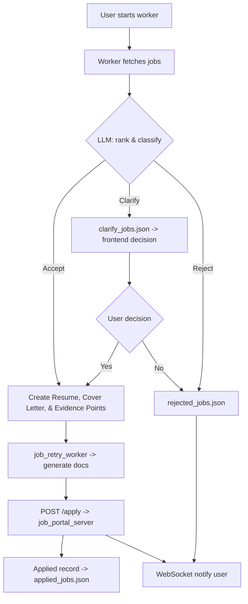

# Job Apply From Resume

A personal project that automates job searching and applying using LLMs, local job management, and a Next.js frontend. The system supports per-user background processing (auto-apply), WebSocket notifications, resume/cover-letter generation, and simple file-backed job queues.

Key features
- Auto-apply background worker per user using `job_manager`.
- LLM-driven ranking, resume, cover letter and clarification generation (`llm_handle.py`).
- WebSocket live notifications to frontend (`/ws/{user_id}`).
- Frontend built with Next.js (app router) and Tailwind CSS.
- Simple file-backed per-user job queues stored in user folders (e.g. `./<user_id>/pending_jobs.json`).
- Local job portal server (`job_portal_server`) for safe testing and understanding the apply flow without interacting with official job boards.

Repository layout (important files/folders)
- `backend/` — FastAPI backend and job manager
  - `server.py` — main FastAPI app and routes
  - `job_manager.py` — background processing and worker orchestration
  - `llm_handle.py` — LLM prompts and helpers
  - `websocker_handle.py` — WebSocket manager
  - `db/` — mongo helper and sample notebooks
- `frontend/` — Next.js frontend (app dir)
  - `app/` — pages and API integration
  - `components/Notification.tsx` — notification menu with sound
- `job_portal_server/` — local job portal for development and testing
  - `server.py` — mock job portal API endpoints for `/apply` and `/status`
  - `jobs.json` — seed job listings for testing (add your test jobs here)
  - `search_jobs.py` — job search utilities
- `improvment_possible.md` — notes on improvements and roadmap

Environment & Requirements
- Backend (Python):
  - Recommended: Python 3.10+
  - Install: `pip install -r backend/requirements.txt`
  - Important env vars (add to `.env` in `backend/`):
    - `API_BASE_URL` — base URL of the local job portal service (e.g., `http://localhost:5000`)
    - `HUGGINGFACEHUB_API_TOKEN` — HuggingFace API token for LLM endpoints
    - `HF_MODEL` — HuggingFace model name (e.g., `meta-llama/Llama-3.1-8B-Instruct`)
    - `MONGO_URI` — MongoDB connection URI (e.g., `mongodb://localhost:27017/`)
    - `PORT` — backend server port (default 8000)
- Frontend (Node):
  - Node 18+ recommended
  - Install: `cd frontend && npm install`
  - Run: `npm run dev` (Next.js dev server)
  - Important env vars (add to `.env` in `frontend/`):
    - `NEXT_PUBLIC_BACKEND_URL` — URL of the backend (e.g., `http://127.0.0.1:8000`)
    - `NEXT_PUBLIC_APP_URL` — Frontend application URL (e.g., `http://localhost:3000`)
    - `JWT_SECRET` — Secret key for JWT token generation

Running locally
1. Start job portal server (local testing portal)

```bash
cd job_portal_server
python server.py
```

This starts a mock job portal on port 5000. The backend will submit applications to this local server during testing.

2. Start backend

```bash
cd backend
pip install -r requirements.txt
python server.py
```

or (recommended)

```bash
uvicorn server:app --reload --host 0.0.0.0 --port 8000
```

3. Frontend

```bash
cd frontend
npm install
npm run dev
```

Core concepts and user flow
1) Authentication & profile
- Users register/login via `POST /api/register` and `POST /api/login` (backend handles auth and returns a JWT). The frontend stores `user_id` in a cookie for identifying per-user job files and sockets.

2) Auto-apply background worker
- When `POST /user/{user_id}/start` is called, `job_manager` creates a `User` worker which:
  - Fetches or generates job lists
  - Calls `llm_handle.separate_and_rank_jobs()` to score and categorize jobs
  - For accepted jobs, `job_retry_worker()` performs document generation and attempts to submit via `API_BASE_URL/apply` with retry logic
  - Notifies the user via WebSocket messages (applied, rejected, clarify)

3) Clarification flow (manual)
- Some jobs are placed into `{user_id}/clarify_jobs.json` requiring a user decision.
- Frontend clarify page (`/clarify-jobs`) lists these jobs; the user can Approve (yes) or Discard (no).
  - Approve (yes): frontend calls backend `POST /clarify/{user_id}/submit?job_id=...&decision=yes` — the backend uses the existing `job_retry_worker()` to submit the application (synchronously, with retries). On success the job is removed from `clarify_jobs.json` and appended to `applied_jobs.json`.
  - Discard (no): backend moves the job into `rejected_jobs.json` and removes it from `clarify_jobs.json`.

**Flowchart**



4) Notifications
- WebSocket route: `/ws/{user_id}` — backend sends small JSON objects for events: { type: 'applied'|'rejected'|'clarify', message: string, job_id: string }.
- Frontend `Notification` component connects to the WebSocket and plays a short beep on incoming messages.

API Reference (detailed)
- GET /health
  - Returns basic health + UTC time.

- POST /api/register
  - Body: { user, password, ... }
  - Response: { success: true, user, token }

- POST /api/login
  - Body: { email, password }
  - Response: { success: true, user, token }

- GET /jobs/{user_id}/applied
  - Returns: { jobs: [...] } — reads `./{user_id}/applied_jobs.json` under a FileLock

- GET /jobs/{user_id}/pending
  - Returns: { jobs: [...] } — reads `./{user_id}/pending_jobs.json`

- GET /jobs/{user_id}/rejected
  - Returns: { jobs: [...] } — reads `./{user_id}/rejected_jobs.json`

- GET /jobs/{user_id}/calrify
  - Returns: { jobs: [...] } — reads `./{user_id}/clarify_jobs.json`

- POST /user/{user_id}/start
  - Kicks off the per-user background worker (creates User instance and starts processing loop in a thread). Worker will send websocket messages and write to per-user files.

- POST /user/{user_id}/stop
  - Stops the worker by marking `user.is_active = False`.

- GET /user/{user_id}/processing-status
  - Returns: { user_id, is_active }

- GET /status/{user_id}
  - Aggregates remote status via `API_BASE_URL/status?user_id=...` and returns the remote `status` payload.

- POST /clarify/{user_id}/submit?job_id={job_id}&decision={yes|no}
  - Used by the frontend clarify page.
  - If decision=yes: backend uses the existing `job_retry_worker(user, job, user_data)` to submit application synchronously (with retry logic). On success the job is removed from `clarify_jobs.json` and appended to `applied_jobs.json`.
  - If decision=no: job is moved to `rejected_jobs.json` and removed from `clarify_jobs.json`.
  - All file writes use `FileLock` to avoid race conditions.

WebSocket payloads
- { type: 'applied', message: 'Application for X applied', job_id: 'job_123' }
- { type: 'rejected', message: 'Application discarded', job_id: 'job_123' }
- { type: 'clarify', message: 'Needs clarification', job_id: 'job_123' }

Implementation notes & conventions
- Per-user files live at `./{user_id}/` and include `applied_jobs.json`, `pending_jobs.json`, `clarify_jobs.json`, `rejected_jobs.json`.
- File access is always protected by `FileLock(path + ".lock")` and follows the read-modify-write pattern.
- LLM helpers in `llm_handle.py` use prompt chains; keep their usage synchronous/async as currently implemented and prefer reusing existing helpers (e.g., `job_retry_worker`).

Development tips and troubleshooting
- If you see corrupted JSON files in a user's folder, delete or move them; the code treats JSONDecodeError as an empty list.
- To inspect live notifications, open browser DevTools Console and check WebSocket connection logs. Backend prints socket connect/disconnect messages.
- **Testing your resume with jobs:** To test the system with your own resume, add relevant job listings to `job_portal_server/jobs.json`. The job format should match the schema expected by the backend (typically including title, description, company, requirements, link, etc.). When the backend starts, it will fetch and process these jobs.
- **Important:** The `job_portal_server` is a local mock portal used strictly for development and testing. It does NOT interact with any official job boards or APIs. This allows you to safely test the entire workflow, understand how the system works, and validate your resume and cover letter generation without affecting real job applications.

Suggested next steps (from improvment_possible.md)
- Move per-user job storage to a DB for production safety (Mongo/Postgres).
- Add an aggregated `/dashboard-stats/{user_id}` endpoint to reduce frontend calls.
- Add user notification preferences to toggle sound and message types.

Contact / Notes
- This README is intended to provide a clear developer-oriented guide for running and extending the project. If you want a condensed user-facing README or a deployment guide (Docker), I can add that as well.
